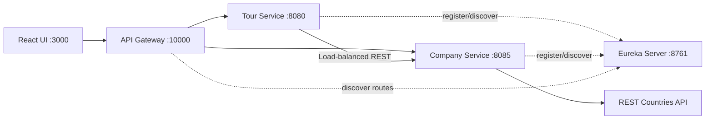

# WonderTour Lab Test 02 - Reference Solution

[Tiếng Việt](README.md) |
[English](docs/i18n/README.en.md) |
[हिन्दी](docs/i18n/README.hi.md) |
[한국어](docs/i18n/README.ko.md) |
[简体中文](docs/i18n/README.zh-CN.md) |
[日本語](docs/i18n/README.ja.md) |
[繁體中文（台灣）](docs/i18n/README.zh-TW.md)

> [!CAUTION]
> Đây là **solution tham khảo được hoàn thiện lại sau bài Lab Test**, không phải
> đáp án chính thức của RMIT hay giảng viên. Cách diễn giải rubric, kiến trúc và
> một số chi tiết triển khai có thể chưa hoàn toàn chính xác. Hãy tự đối chiếu
> với đề bài, rubric và hướng dẫn mới nhất trước khi sử dụng. Không nên sao chép
> nguyên repository này để nộp cho một bài đánh giá.

WonderTour là ứng dụng quản trị tour tại Đông Nam Á. Repository triển khai theo
hướng **Backend Specialist**, sử dụng Spring Boot microservices và React.

## Nội dung chính

- Quản lý tour: xem, tạo, cập nhật và xóa.
- Xác thực dữ liệu tour ở cả frontend và backend.
- Lazy loading 5 tour mỗi lần từ backend.
- Company profile với quốc gia, doanh thu và cờ lấy từ REST Countries.
- Chọn company vận hành tour khi tạo hoặc cập nhật.
- Ticket cart hỗ trợ nhiều tour, tăng/giảm số lượng, tổng tiền và tổng vé.
- Cart được lưu trong `localStorage`, không mất khi refresh hoặc đổi trang.
- API Gateway và Eureka Service Discovery.
- Giao tiếp Tour Service -> Company Service bằng REST qua service discovery.

## Kiến trúc



### Backend layers

Mỗi business service tách các trách nhiệm chính:

- `controller`: public REST endpoints.
- `service`: interface và implementation chứa business logic.
- `repository`: truy cập dữ liệu JPA.
- `model`: persistence entities, không trả trực tiếp ra public API.
- `dto`: request/response contracts.
- `client`: interface giao tiếp với service hoặc API bên ngoài.
- `seed`: sinh dữ liệu mẫu.
- `exception`: domain errors và HTTP error mapping.

### Frontend layers

- `src/config`: cấu hình URL và constant dùng chung.
- `src/api`: HTTP client/helper dùng chung.
- `src/features/*/api`: API calls theo domain.
- `src/features/*/hooks`: state và event handlers theo domain.
- `src/features/cart`: global cart state và persistence.
- `src/components`: presentational UI.
- `src/pages`: composition cho Tour và Company pages.

## Công nghệ

| Thành phần | Công nghệ |
| --- | --- |
| Frontend | React 19, Vite 7, Tailwind CSS 4, Axios |
| Backend | Java 17+, Spring Boot 3.2.5 |
| Cloud | Spring Cloud 2023.0.1 |
| Database | H2 in-memory, database name `wondertour` |
| Discovery | Netflix Eureka |
| Gateway | Spring Cloud Gateway |
| Tests | JUnit 5, Mockito, AssertJ |

## Ports

| Service | Port |
| --- | ---: |
| Frontend | `3000` |
| Tour Service | `8080` |
| Company Service | `8085` |
| Eureka Server | `8761` |
| API Gateway | `10000` |

Frontend chỉ nên gọi API thông qua gateway:

```text
http://localhost:10000
```

## Cấu trúc repository

```text
.
|-- backend
|   |-- api-gateway
|   |-- company-service
|   |-- eureka-server
|   `-- tour-service
|-- frontend
|-- .gitignore
`-- README.md
```

## Yêu cầu môi trường

- JDK 17 hoặc mới hơn.
- Maven 3.8+.
- Node.js 20+.
- npm 10+.

Kiểm tra:

```powershell
java -version
mvn -version
node --version
npm --version
```

## Chạy ứng dụng

Khởi động theo đúng thứ tự dưới đây. Mỗi lệnh backend nên chạy trong một
terminal riêng.

### 1. Eureka Server

```powershell
cd backend/eureka-server
mvn spring-boot:run
```

Mở dashboard: <http://localhost:8761>

### 2. Company Service

```powershell
cd backend/company-service
mvn spring-boot:run
```

### 3. Tour Service

```powershell
cd backend/tour-service
mvn spring-boot:run
```

### 4. API Gateway

```powershell
cd backend/api-gateway
mvn spring-boot:run
```

### 5. Frontend

```powershell
cd frontend
npm install
npm run dev
```

Mở ứng dụng: <http://localhost:3000>

Sau khi tất cả service chạy, Eureka dashboard phải hiển thị:

- `API-GATEWAY`
- `COMPANY-SERVICE`
- `TOUR-SERVICE`

## Environment variables

Các giá trị sau có default phù hợp khi chạy local:

| Biến | Default | Dùng tại |
| --- | --- | --- |
| `EUREKA_URL` | `http://localhost:8761/eureka/` | Gateway và services |
| `COMPANY_SERVICE_URL` | `http://company-service` | Tour Service |
| `REST_COUNTRIES_API_URL` | `https://restcountries.com/v3.1/name` | Company Service |
| `FRONTEND_ORIGIN` | `http://localhost:3000` | Gateway CORS |
| `FRONTEND_IP_ORIGIN` | `http://127.0.0.1:3000` | Gateway CORS |
| `VITE_API_BASE_URL` | `http://localhost:10000` | Frontend |

Ví dụ đổi gateway URL cho frontend:

```powershell
$env:VITE_API_BASE_URL="http://localhost:10000"
npm run dev
```

## API contracts

### Tours

| Method | Endpoint | Mô tả |
| --- | --- | --- |
| `GET` | `/tours?page=1&limit=5` | Lấy một page tour |
| `GET` | `/tours?companyId=1` | Lấy tour theo company |
| `GET` | `/tours/{id}` | Lấy một tour |
| `POST` | `/tours` | Tạo tour |
| `PUT` | `/tours/{id}` | Cập nhật tour tồn tại |
| `DELETE` | `/tours/{id}` | Xóa tour tồn tại |

Request tạo/cập nhật:

```json
{
  "name": "Ha Long Bay Cruise",
  "price": 150,
  "companyId": 1
}
```

Validation:

- `name` bắt buộc và không được rỗng.
- `price` bắt buộc và phải lớn hơn `0`.
- `companyId` bắt buộc và phải tồn tại trong Company Service.

Response tour không trả `createdAt`:

```json
{
  "id": 1,
  "name": "Ha Long Bay Cruise",
  "price": 150,
  "company": {
    "id": 1,
    "name": "Vietnam Horizon Travel"
  }
}
```

### Companies

| Method | Endpoint | Mô tả |
| --- | --- | --- |
| `GET` | `/companies/dropdown` | Chỉ trả `id` và `name` |
| `GET` | `/companies/{id}` | Company profile và flag URL |

## Dữ liệu mẫu

Ứng dụng sinh:

- 3 companies tại Việt Nam, Thái Lan và Indonesia.
- 12 tours thuộc Đông Nam Á.
- Tour IDs được sinh tự động bởi H2.

H2 đang chạy ở chế độ in-memory và `ddl-auto=create-drop`, vì vậy dữ liệu thay
đổi sẽ mất khi service dừng. Đây là chủ đích để demo và kiểm thử nhanh.

## Chạy kiểm thử

```powershell
cd backend/tour-service
mvn test

cd ../company-service
mvn test

cd ../../frontend
npm run build
```

Bộ test hiện có kiểm tra:

- Backend validation cho tour.
- Mapping paginated tour response và company summary.
- Từ chối company không tồn tại.
- Company profile DTO và not-found behavior.

## Luồng kiểm thử thủ công đề xuất

1. Xác nhận trang đầu chỉ hiển thị 5 trong tổng số 12 tour.
2. Nhấn `Load More` và kiểm tra backend trả subset tiếp theo.
3. Submit form rỗng và kiểm tra ba validation messages.
4. Tạo tour mới với company.
5. Mở update dialog và kiểm tra dữ liệu được prefill.
6. Đổi name, price và operating company.
7. Book tour, tăng/giảm quantity và refresh để kiểm tra persistence.
8. Mở company hyperlink, kiểm tra profile, flag 30px và các tour tương ứng.
9. Xóa tour và kiểm tra dialog có đúng tour name và ID.

## Giới hạn và điểm cần cân nhắc

- Chưa triển khai Kafka; giao tiếp giữa microservices đang dùng REST.
- Chưa có authentication/authorization cho admin.
- Chưa có Docker Compose hoặc persistent production database.
- Flag phụ thuộc REST Countries; profile vẫn hoạt động nếu API cờ tạm lỗi,
  nhưng có thể không hiển thị ảnh.
- Không có distributed tracing, circuit breaker hoặc centralized config.
- UI tập trung vào việc thể hiện feature và architecture hơn là production UX.
- Cách phân chia internal/external interface và DTO là một cách diễn giải
  rubric, không đảm bảo trùng hoàn toàn với cách chấm chính thức.

## Tài liệu bổ sung

Hướng dẫn chi tiết cho Service Discovery:

- [`backend/EUREKA-DISCOVERY-SETUP.md`](backend/EUREKA-DISCOVERY-SETUP.md)

## Disclaimer

Repository này nhằm mục đích học tập và tham khảo kiến trúc. Nó có thể chứa
thiếu sót hoặc khác biệt so với expected solution. Người sử dụng chịu trách
nhiệm tự kiểm chứng correctness, cập nhật dependency và tuân thủ academic
integrity policy của môn học hoặc tổ chức liên quan.
