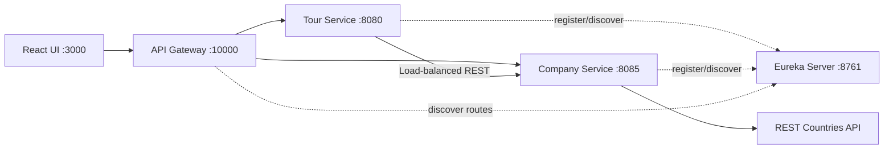

# WonderTour Lab Test 02 - Reference Solution

[Tiếng Việt](../../README.md) |
[English](README.en.md) |
[हिन्दी](README.hi.md) |
[한국어](README.ko.md) |
[简体中文](README.zh-CN.md) |
[日本語](README.ja.md) |
[繁體中文（台灣）](README.zh-TW.md)

> [!CAUTION]
> This is a **post-assessment reference solution**, not an official answer
> from RMIT or its teaching staff. The interpretation of the rubric,
> architecture, and implementation may be incomplete or inaccurate. Verify it
> against the current assessment specification and academic integrity policy.
> Do not submit this repository as your own assessed work.

WonderTour is a Southeast Asia tour administration application implemented as
a **Backend Specialist** solution with Spring Boot microservices and React.

## Features

- Read, create, update, and delete tours.
- Frontend and backend validation.
- Backend pagination with five tours loaded at a time.
- Company profiles with country, revenue, and REST Countries flag data.
- Company selection during tour creation and update.
- Persistent ticket cart with quantity controls, totals, and `localStorage`.
- API Gateway, Eureka Service Discovery, and load-balanced REST communication.

## Architecture



Backend services separate controllers, service interfaces and implementations,
repositories, persistence models, DTOs, external clients, seeders, and exception
handling. The frontend separates global configuration, a shared HTTP helper,
domain APIs, hooks, cart state, UI components, and pages.

## Technology And Ports

| Component | Technology / Port |
| --- | --- |
| Frontend | React 19, Vite 7, Tailwind CSS 4, Axios / `3000` |
| Tour Service | Java 17+, Spring Boot 3.2.5 / `8080` |
| Company Service | Java 17+, Spring Boot 3.2.5 / `8085` |
| Eureka Server | Spring Cloud Netflix / `8761` |
| API Gateway | Spring Cloud Gateway / `10000` |
| Database | H2 in-memory database named `wondertour` |

## Requirements

- JDK 17 or newer
- Maven 3.8+
- Node.js 20+
- npm 10+

## Run Locally

Start each backend service in a separate terminal, in this order:

```powershell
cd backend/eureka-server
mvn spring-boot:run
```

```powershell
cd backend/company-service
mvn spring-boot:run
```

```powershell
cd backend/tour-service
mvn spring-boot:run
```

```powershell
cd backend/api-gateway
mvn spring-boot:run
```

Then start the frontend:

```powershell
cd frontend
npm install
npm run dev
```

Open <http://localhost:3000>. The frontend calls the gateway at
<http://localhost:10000>.

## Main API

| Method | Endpoint | Purpose |
| --- | --- | --- |
| `GET` | `/tours?page=1&limit=5` | Paginated tours |
| `GET` | `/tours?companyId=1` | Tours operated by a company |
| `GET` | `/tours/{id}` | One tour |
| `POST` | `/tours` | Create a tour |
| `PUT` | `/tours/{id}` | Update an existing tour |
| `DELETE` | `/tours/{id}` | Delete an existing tour |
| `GET` | `/companies/dropdown` | Company `id` and `name` only |
| `GET` | `/companies/{id}` | Company profile |

Create/update payload:

```json
{
  "name": "Ha Long Bay Cruise",
  "price": 150,
  "companyId": 1
}
```

`name`, positive `price`, and an existing `companyId` are required. Public tour
responses intentionally omit `createdAt`.

## Tests

```powershell
cd backend/tour-service
mvn test

cd ../company-service
mvn test

cd ../../frontend
npm run build
```

## Known Limitations

- Kafka is not implemented; microservices communicate through REST.
- There is no authentication or authorization.
- H2 is in-memory and data is recreated when services restart.
- There is no Docker Compose, persistent production database, circuit breaker,
  distributed tracing, or centralized configuration.
- Flag rendering depends on REST Countries availability.
- The architecture is one interpretation of the rubric, not a guaranteed
  official marking solution.

For detailed discovery instructions, see
[`backend/EUREKA-DISCOVERY-SETUP.md`](../../backend/EUREKA-DISCOVERY-SETUP.md).
