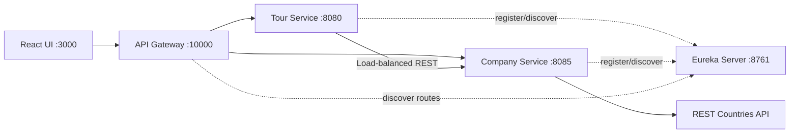

# WonderTour Lab Test 02 - संदर्भ समाधान

[Tiếng Việt](../../README.md) |
[English](README.en.md) |
[हिन्दी](README.hi.md) |
[한국어](README.ko.md) |
[简体中文](README.zh-CN.md) |
[日本語](README.ja.md) |
[繁體中文（台灣）](README.zh-TW.md)

> [!CAUTION]
> यह **परीक्षा के बाद तैयार किया गया संदर्भ समाधान** है, RMIT या शिक्षक का
> आधिकारिक उत्तर नहीं। Rubric, architecture और implementation की व्याख्या
> अधूरी या गलत हो सकती है। उपयोग से पहले वर्तमान प्रश्न, rubric और academic
> integrity policy से स्वयं मिलान करें। इसे अपने मूल्यांकन कार्य के रूप में
> सीधे जमा न करें।

WonderTour दक्षिण-पूर्व एशिया के tours के लिए admin application है। यह
**Backend Specialist** दिशा में Spring Boot microservices और React से बनाया
गया है।

## मुख्य सुविधाएँ

- Tours को देखना, बनाना, अपडेट करना और हटाना।
- Frontend और backend दोनों पर validation।
- Backend से एक बार में 5 tours का lazy loading।
- Country, revenue और REST Countries flag वाला company profile।
- Tour बनाते या अपडेट करते समय operating company चुनना।
- Quantity, total tickets, total price और `localStorage` वाला persistent cart।
- API Gateway, Eureka Service Discovery और load-balanced REST communication।

## Architecture



Backend में controller, service interface/implementation, repository, model,
DTO, external client, seed और exception layers अलग हैं। Frontend में config,
shared HTTP helper, domain API, hooks, cart state, components और pages अलग हैं।

## Technology और Ports

| Service | Port |
| --- | ---: |
| Frontend | `3000` |
| Tour Service | `8080` |
| Company Service | `8085` |
| Eureka Server | `8761` |
| API Gateway | `10000` |

आवश्यक tools: JDK 17+, Maven 3.8+, Node.js 20+ और npm 10+।

## Local Run

अलग terminals में इसी क्रम से चलाएँ:

```powershell
cd backend/eureka-server
mvn spring-boot:run
```

```powershell
cd backend/company-service
mvn spring-boot:run
```

```powershell
cd backend/tour-service
mvn spring-boot:run
```

```powershell
cd backend/api-gateway
mvn spring-boot:run
```

```powershell
cd frontend
npm install
npm run dev
```

Application: <http://localhost:3000>, Gateway: <http://localhost:10000>

## मुख्य API

| Method | Endpoint | विवरण |
| --- | --- | --- |
| `GET` | `/tours?page=1&limit=5` | Paginated tours |
| `GET` | `/tours?companyId=1` | Company के tours |
| `POST` | `/tours` | Tour बनाना |
| `PUT` | `/tours/{id}` | Tour अपडेट करना |
| `DELETE` | `/tours/{id}` | Tour हटाना |
| `GET` | `/companies/dropdown` | केवल company `id` और `name` |
| `GET` | `/companies/{id}` | Company profile |

```json
{
  "name": "Ha Long Bay Cruise",
  "price": 150,
  "companyId": 1
}
```

`name`, शून्य से बड़ा `price` और मौजूद `companyId` आवश्यक हैं। Tour response
में जानबूझकर `createdAt` नहीं दिया जाता।

## Tests

```powershell
cd backend/tour-service
mvn test

cd ../company-service
mvn test

cd ../../frontend
npm run build
```

## सीमाएँ

- Kafka लागू नहीं है; services REST से बात करती हैं।
- Authentication और authorization नहीं है।
- H2 in-memory है, इसलिए restart पर data फिर से बनता है।
- Docker Compose, production database, circuit breaker और tracing नहीं हैं।
- Flag के लिए REST Countries उपलब्ध होना आवश्यक है।
- यह rubric की एक व्याख्या है, आधिकारिक marking solution नहीं।

Discovery guide:
[`backend/EUREKA-DISCOVERY-SETUP.md`](../../backend/EUREKA-DISCOVERY-SETUP.md)
