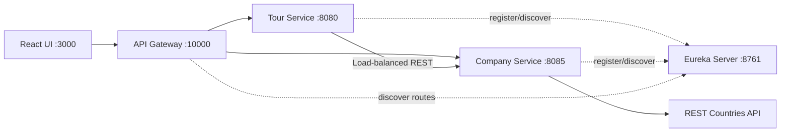

# WonderTour Lab Test 02 - 参考ソリューション

[Tiếng Việt](../../README.md) |
[English](README.en.md) |
[हिन्दी](README.hi.md) |
[한국어](README.ko.md) |
[简体中文](README.zh-CN.md) |
[日本語](README.ja.md) |
[繁體中文（台灣）](README.zh-TW.md)

> [!CAUTION]
> このリポジトリは**試験後に整理した参考ソリューション**であり、
> RMIT や担当教員による公式解答ではありません。Rubric、architecture、
> implementation の解釈が不完全または不正確な可能性があります。
> 利用前に最新の課題仕様、評価基準、academic integrity policyを確認して
> ください。このリポジトリを自分の評価課題としてそのまま提出しないで
> ください。

WonderTour は東南アジアの tour を管理する admin application です。
**Backend Specialist** 方針で Spring Boot microservices と React を
使用しています。

## 主な機能

- Tour の参照、作成、更新、削除
- Frontend と backend の両方で validation
- Backend から一度に 5 件ずつ lazy loading
- 国、売上、REST Countries の国旗を表示する company profile
- Tour 作成・更新時の運営 company 選択
- 数量、合計チケット数、合計金額、`localStorage` 永続化を備えた cart
- API Gateway、Eureka Service Discovery、load-balanced REST 通信

## Architecture



Backend は controller、service interface/implementation、repository、
model、DTO、external client、seed、exception handling を分離しています。
Frontend は config、共通 HTTP helper、domain API、hooks、cart state、
components、pages を分離しています。

## 技術と Ports

| Service | Port |
| --- | ---: |
| Frontend | `3000` |
| Tour Service | `8080` |
| Company Service | `8085` |
| Eureka Server | `8761` |
| API Gateway | `10000` |

必要環境: JDK 17+、Maven 3.8+、Node.js 20+、npm 10+。

## ローカル実行

各 backend service を別々の terminal で次の順番に起動します。

```powershell
cd backend/eureka-server
mvn spring-boot:run
```

```powershell
cd backend/company-service
mvn spring-boot:run
```

```powershell
cd backend/tour-service
mvn spring-boot:run
```

```powershell
cd backend/api-gateway
mvn spring-boot:run
```

```powershell
cd frontend
npm install
npm run dev
```

Application: <http://localhost:3000>、Gateway: <http://localhost:10000>

## 主な API

| Method | Endpoint | 説明 |
| --- | --- | --- |
| `GET` | `/tours?page=1&limit=5` | Tour pagination |
| `GET` | `/tours?companyId=1` | Company ごとの Tours |
| `POST` | `/tours` | Tour 作成 |
| `PUT` | `/tours/{id}` | Tour 更新 |
| `DELETE` | `/tours/{id}` | Tour 削除 |
| `GET` | `/companies/dropdown` | Company の `id` と `name` のみ |
| `GET` | `/companies/{id}` | Company profile |

```json
{
  "name": "Ha Long Bay Cruise",
  "price": 150,
  "companyId": 1
}
```

`name`、0 より大きい `price`、存在する `companyId` が必要です。公開
Tour response には `createdAt` を含めません。

## テスト

```powershell
cd backend/tour-service
mvn test

cd ../company-service
mvn test

cd ../../frontend
npm run build
```

## 制限事項

- Kafka は未実装で、services は REST で通信します。
- Authentication と authorization はありません。
- H2 は in-memory のため、再起動時にデータが再生成されます。
- Docker Compose、production database、circuit breaker、tracing はありません。
- 国旗表示は REST Countries の可用性に依存します。
- 公式採点解答ではなく、rubric に対する一つの解釈です。

Discovery guide:
[`backend/EUREKA-DISCOVERY-SETUP.md`](../../backend/EUREKA-DISCOVERY-SETUP.md)
