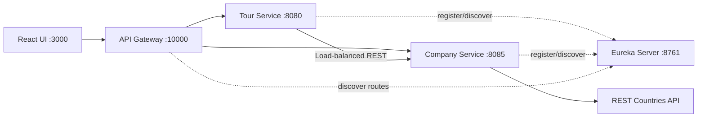

# WonderTour Lab Test 02 - 참고 솔루션

[Tiếng Việt](../../README.md) |
[English](README.en.md) |
[हिन्दी](README.hi.md) |
[한국어](README.ko.md) |
[简体中文](README.zh-CN.md) |
[日本語](README.ja.md) |
[繁體中文（台灣）](README.zh-TW.md)

> [!CAUTION]
> 이 저장소는 **시험 이후 보완한 참고용 솔루션**이며 RMIT 또는 담당
> 교원의 공식 정답이 아닙니다. Rubric, architecture, implementation에
> 대한 해석이 불완전하거나 부정확할 수 있습니다. 사용 전에 최신
> 과제 명세와 academic integrity 정책을 직접 확인하세요. 이 저장소를
> 본인의 평가 과제로 그대로 제출하지 마세요.

WonderTour는 동남아시아 tour를 관리하는 admin application입니다.
**Backend Specialist** 방향으로 Spring Boot microservices와 React를
사용합니다.

## 주요 기능

- Tour 조회, 생성, 수정, 삭제
- Frontend와 backend 양쪽 validation
- Backend에서 한 번에 5개씩 lazy loading
- 국가, 매출, REST Countries 국기를 포함한 company profile
- Tour 생성 및 수정 시 운영 company 선택
- 수량, 총 티켓 수, 총액 및 `localStorage` persistence를 제공하는 cart
- API Gateway, Eureka Service Discovery, load-balanced REST 통신

## Architecture



Backend는 controller, service interface/implementation, repository, model,
DTO, external client, seed, exception handling을 분리합니다. Frontend는
config, 공통 HTTP helper, domain API, hooks, cart state, components, pages를
분리합니다.

## 기술 및 Ports

| Service | Port |
| --- | ---: |
| Frontend | `3000` |
| Tour Service | `8080` |
| Company Service | `8085` |
| Eureka Server | `8761` |
| API Gateway | `10000` |

필수 환경: JDK 17+, Maven 3.8+, Node.js 20+, npm 10+.

## 실행 방법

각 backend service를 별도 terminal에서 순서대로 실행합니다.

```powershell
cd backend/eureka-server
mvn spring-boot:run
```

```powershell
cd backend/company-service
mvn spring-boot:run
```

```powershell
cd backend/tour-service
mvn spring-boot:run
```

```powershell
cd backend/api-gateway
mvn spring-boot:run
```

```powershell
cd frontend
npm install
npm run dev
```

Application: <http://localhost:3000>, Gateway: <http://localhost:10000>

## 주요 API

| Method | Endpoint | 설명 |
| --- | --- | --- |
| `GET` | `/tours?page=1&limit=5` | Tour pagination |
| `GET` | `/tours?companyId=1` | Company별 tours |
| `POST` | `/tours` | Tour 생성 |
| `PUT` | `/tours/{id}` | Tour 수정 |
| `DELETE` | `/tours/{id}` | Tour 삭제 |
| `GET` | `/companies/dropdown` | Company `id`, `name`만 반환 |
| `GET` | `/companies/{id}` | Company profile |

```json
{
  "name": "Ha Long Bay Cruise",
  "price": 150,
  "companyId": 1
}
```

`name`, 0보다 큰 `price`, 존재하는 `companyId`가 필요합니다. Public tour
response에서는 `createdAt`을 반환하지 않습니다.

## 테스트

```powershell
cd backend/tour-service
mvn test

cd ../company-service
mvn test

cd ../../frontend
npm run build
```

## 제한 사항

- Kafka는 구현하지 않았으며 services는 REST로 통신합니다.
- Authentication과 authorization이 없습니다.
- H2는 in-memory이므로 restart 시 데이터가 재생성됩니다.
- Docker Compose, production database, circuit breaker, tracing이 없습니다.
- 국기 표시는 REST Countries 가용성에 의존합니다.
- 공식 채점 정답이 아니라 rubric에 대한 하나의 해석입니다.

Discovery guide:
[`backend/EUREKA-DISCOVERY-SETUP.md`](../../backend/EUREKA-DISCOVERY-SETUP.md)
