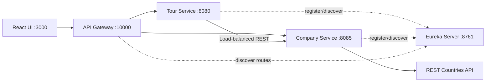

# WonderTour Lab Test 02 - 参考方案

[Tiếng Việt](../../README.md) |
[English](README.en.md) |
[हिन्दी](README.hi.md) |
[한국어](README.ko.md) |
[简体中文](README.zh-CN.md) |
[日本語](README.ja.md) |
[繁體中文（台灣）](README.zh-TW.md)

> [!CAUTION]
> 本仓库是**考试结束后整理的参考方案**，并非 RMIT 或任课教师提供的
> 官方答案。对评分标准、架构和实现方式的理解可能不完整或不准确。
> 使用前请自行对照最新题目、评分标准和学术诚信政策。请勿将本仓库
> 直接作为自己的考核作业提交。

WonderTour 是一个东南亚旅游项目管理后台。本方案以
**Backend Specialist** 为方向，使用 Spring Boot 微服务和 React。

## 主要功能

- 查看、创建、更新和删除 Tour。
- 前端与后端双重数据验证。
- 后端分页，每次加载 5 个 Tour。
- 显示国家、营收和 REST Countries 国旗的 Company profile。
- 创建和更新 Tour 时选择运营 Company。
- 支持数量调整、总票数、总价和 `localStorage` 持久化的购物车。
- API Gateway、Eureka Service Discovery 和负载均衡 REST 通信。

## 架构



后端分离 controller、service interface/implementation、repository、
model、DTO、external client、seed 和 exception handling。前端分离 config、
公共 HTTP helper、domain API、hooks、cart state、components 和 pages。

## 技术与端口

| Service | Port |
| --- | ---: |
| Frontend | `3000` |
| Tour Service | `8080` |
| Company Service | `8085` |
| Eureka Server | `8761` |
| API Gateway | `10000` |

环境要求：JDK 17+、Maven 3.8+、Node.js 20+、npm 10+。

## 本地运行

请在不同终端中按以下顺序启动：

```powershell
cd backend/eureka-server
mvn spring-boot:run
```

```powershell
cd backend/company-service
mvn spring-boot:run
```

```powershell
cd backend/tour-service
mvn spring-boot:run
```

```powershell
cd backend/api-gateway
mvn spring-boot:run
```

```powershell
cd frontend
npm install
npm run dev
```

应用：<http://localhost:3000>，Gateway：<http://localhost:10000>

## 主要 API

| Method | Endpoint | 说明 |
| --- | --- | --- |
| `GET` | `/tours?page=1&limit=5` | 分页 Tour |
| `GET` | `/tours?companyId=1` | 指定 Company 的 Tours |
| `POST` | `/tours` | 创建 Tour |
| `PUT` | `/tours/{id}` | 更新 Tour |
| `DELETE` | `/tours/{id}` | 删除 Tour |
| `GET` | `/companies/dropdown` | 仅返回 Company `id` 和 `name` |
| `GET` | `/companies/{id}` | Company profile |

```json
{
  "name": "Ha Long Bay Cruise",
  "price": 150,
  "companyId": 1
}
```

必须提供 `name`、大于 0 的 `price` 和有效的 `companyId`。公开 Tour
响应不会返回 `createdAt`。

## 测试

```powershell
cd backend/tour-service
mvn test

cd ../company-service
mvn test

cd ../../frontend
npm run build
```

## 已知限制

- 未实现 Kafka，微服务通过 REST 通信。
- 未实现身份验证和权限控制。
- H2 为内存数据库，服务重启后数据会重新生成。
- 未提供 Docker Compose、生产数据库、熔断器和分布式追踪。
- 国旗显示依赖 REST Countries 服务。
- 本方案只是对评分标准的一种理解，不保证与官方评分方式完全一致。

Discovery guide:
[`backend/EUREKA-DISCOVERY-SETUP.md`](../../backend/EUREKA-DISCOVERY-SETUP.md)
