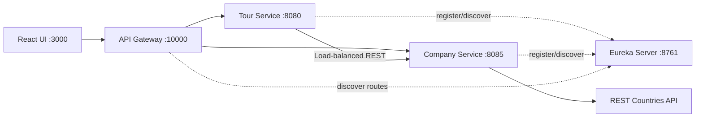

# WonderTour Lab Test 02 - 參考解決方案

[Tiếng Việt](../../README.md) |
[English](README.en.md) |
[हिन्दी](README.hi.md) |
[한국어](README.ko.md) |
[简体中文](README.zh-CN.md) |
[日本語](README.ja.md) |
[繁體中文（台灣）](README.zh-TW.md)

> [!CAUTION]
> 本 repository 是**考試結束後整理的參考解決方案**，並非 RMIT 或授課
> 教師提供的官方答案。對 rubric、architecture 與 implementation 的理解
> 可能不完整或不正確。使用前請自行核對最新題目、評分標準與 academic
> integrity policy。請勿直接將本 repository 當作自己的評量作業提交。

WonderTour 是管理東南亞旅遊行程的 admin application。本方案以
**Backend Specialist** 為方向，使用 Spring Boot microservices 與 React。

## 主要功能

- 查看、建立、更新與刪除 Tour。
- Frontend 與 backend 雙重資料驗證。
- Backend 分頁，每次載入 5 筆 Tour。
- 顯示國家、營收及 REST Countries 國旗的 company profile。
- 建立與更新 Tour 時選擇營運 Company。
- 支援數量調整、總票數、總價及 `localStorage` 持久化的購物車。
- API Gateway、Eureka Service Discovery 與負載平衡 REST 通訊。

## 架構



Backend 分離 controller、service interface/implementation、repository、
model、DTO、external client、seed 與 exception handling。Frontend 分離
config、共用 HTTP helper、domain API、hooks、cart state、components 與 pages。

## 技術與 Ports

| Service | Port |
| --- | ---: |
| Frontend | `3000` |
| Tour Service | `8080` |
| Company Service | `8085` |
| Eureka Server | `8761` |
| API Gateway | `10000` |

環境需求：JDK 17+、Maven 3.8+、Node.js 20+、npm 10+。

## 本機執行

請在不同 terminal 依序啟動：

```powershell
cd backend/eureka-server
mvn spring-boot:run
```

```powershell
cd backend/company-service
mvn spring-boot:run
```

```powershell
cd backend/tour-service
mvn spring-boot:run
```

```powershell
cd backend/api-gateway
mvn spring-boot:run
```

```powershell
cd frontend
npm install
npm run dev
```

Application：<http://localhost:3000>，Gateway：<http://localhost:10000>

## 主要 API

| Method | Endpoint | 說明 |
| --- | --- | --- |
| `GET` | `/tours?page=1&limit=5` | Tour 分頁 |
| `GET` | `/tours?companyId=1` | 指定 Company 的 Tours |
| `POST` | `/tours` | 建立 Tour |
| `PUT` | `/tours/{id}` | 更新 Tour |
| `DELETE` | `/tours/{id}` | 刪除 Tour |
| `GET` | `/companies/dropdown` | 僅回傳 Company `id` 與 `name` |
| `GET` | `/companies/{id}` | Company profile |

```json
{
  "name": "Ha Long Bay Cruise",
  "price": 150,
  "companyId": 1
}
```

必須提供 `name`、大於 0 的 `price` 與有效的 `companyId`。公開 Tour
response 不會回傳 `createdAt`。

## 測試

```powershell
cd backend/tour-service
mvn test

cd ../company-service
mvn test

cd ../../frontend
npm run build
```

## 已知限制

- 尚未實作 Kafka，microservices 透過 REST 通訊。
- 尚未實作 authentication 與 authorization。
- H2 為 in-memory database，service 重啟後資料會重新建立。
- 未提供 Docker Compose、production database、circuit breaker 與 tracing。
- 國旗顯示依賴 REST Countries 的可用性。
- 本方案只是對 rubric 的一種理解，不保證與官方評分方式完全相同。

Discovery guide:
[`backend/EUREKA-DISCOVERY-SETUP.md`](../../backend/EUREKA-DISCOVERY-SETUP.md)
